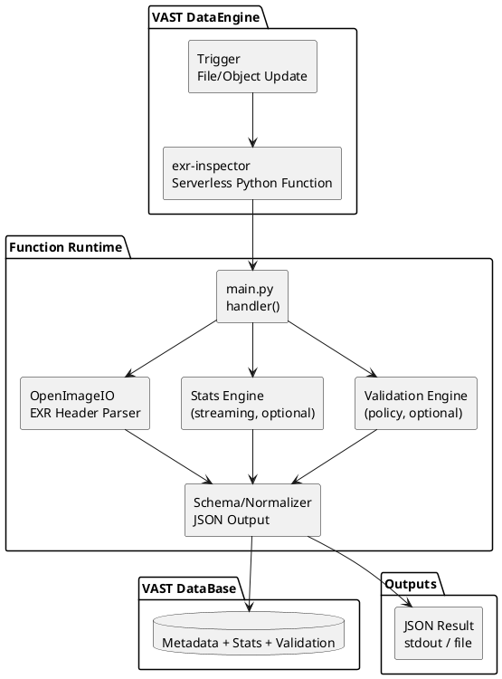
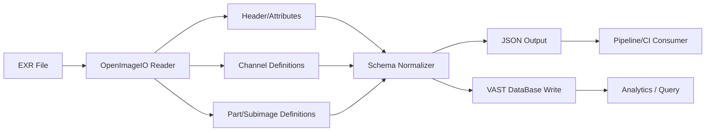

# Architecture Diagram

## Mermaid

```mermaid
flowchart LR
    subgraph VAST_DataEngine[ VAST DataEngine ]
        Trigger[Trigger
File/Object Update]
        Function[exr-inspector
Serverless Python Function]
        Trigger --> Function
    end

    subgraph Runtime[Function Runtime]
        Handler[main.py
handler()]
        Parser[OpenImageIO
EXR Header Parser]
        Stats[Stats Engine
(streaming, optional)]
        Validation[Validation Engine
(policy, optional)]
        Serializer[Schema/Normalizer
JSON Output]

        Handler --> Parser
        Handler --> Stats
        Handler --> Validation
        Parser --> Serializer
        Stats --> Serializer
        Validation --> Serializer
    end

    Function --> Handler

    subgraph Storage[ VAST DataBase ]
        DB[(Metadata + Stats + Validation)]
    end

    Serializer --> DB

    subgraph Outputs[Outputs]
        JSON[JSON Result
stdout / file]
    end

    Serializer --> JSON
```

## PlantUML



## Data Flow (Mermaid)



## JSON Schema Visual Map (Mermaid)

```mermaid
mindmap
  root((exr-inspector JSON))
    schema_version
    file
      path
      size_bytes
      mtime
      exr_version
      multipart_count
      is_deep
    parts
      part_index
      part_name
      view_name
      multi_view
      data_window
      display_window
      pixel_aspect_ratio
      line_order
      compression
      tiling
    channels
      part_index
      name
      type
      x_sampling
      y_sampling
    attributes
      parts[]
        name
        type
        value
    stats
      status
      reason
    validation
      status
      reason
    errors
    future_fields
      provenance
        source_app
        render_engine
        show
        sequence
        shot
        asset
        frame
      color_imaging
        colorspace
        chromaticities
        ocio_colorspace
      render_metadata
        camera_fov
        render_time_ms
        sample_count
      layer_semantics
        layer_role
        lpe_tags
        channel_purpose
      deep_data
        deep_sample_count
        deep_min_samples
        deep_max_samples
      integrity
        header_hash
        file_hash
        tool_version
      pipeline_validation
        policy_id
        rule_id
        severity
      performance
        parse_time_ms
        stats_time_ms
        memory_peak_mb
      access_storage
        storage_tier
        filesystem
        bucket
        region
        tenant_id
```
