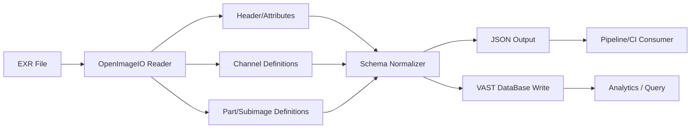

# exr-inspector Overview

## What It Does

`exr-inspector` is a serverless Python function for VAST DataEngine that inspects OpenEXR files, extracts metadata, and emits deterministic JSON suitable for automation and database indexing. The function runs close to the data, reads headers safely, and can optionally compute stats and validation results when enabled.

## Architecture (High-Level)

```mermaid
flowchart LR
    subgraph VAST_DataEngine[ VAST DataEngine ]
        Trigger[Trigger\nFile/Object Update]
        Function[exr-inspector\nServerless Python Function]
        Trigger --> Function
    end

    subgraph Runtime[Function Runtime]
        Handler[main.py\nhandler()]
        Parser[OpenImageIO\nEXR Header Parser]
        Stats[Stats Engine\n(streaming, optional)]
        Validation[Validation Engine\n(policy, optional)]
        Serializer[Schema/Normalizer\nJSON Output]

        Handler --> Parser
        Handler --> Stats
        Handler --> Validation
        Parser --> Serializer
        Stats --> Serializer
        Validation --> Serializer
    end

    Function --> Handler

    subgraph Storage[ VAST DataBase ]
        DB[(Metadata + Stats + Validation)]
    end

    Serializer --> DB

    subgraph Outputs[Outputs]
        JSON[JSON Result\nstdout / file]
    end

    Serializer --> JSON
```

## Data Flow



## Output Shape (Conceptual)

```mermaid
mindmap
  root((exr-inspector JSON))
    schema_version
    file
      path
      size_bytes
      mtime
      exr_version
      multipart_count
      is_deep
    parts
      part_index
      part_name
      view_name
      multi_view
      data_window
      display_window
      pixel_aspect_ratio
      line_order
      compression
      tiling
    channels
      part_index
      name
      type
      x_sampling
      y_sampling
    attributes
      parts[]
        name
        type
        value
    stats
      status
      reason
    validation
      status
      reason
    errors
```

## Current Capabilities

- File metadata (path, size, mtime)
- EXR header extraction via OpenImageIO
- Multipart/deep detection
- Channels + attributes normalization
- DataEngine deployment scaffold

## Planned Capabilities

- Streaming pixel stats
- Policy-based validation
- VAST DataBase persistence
